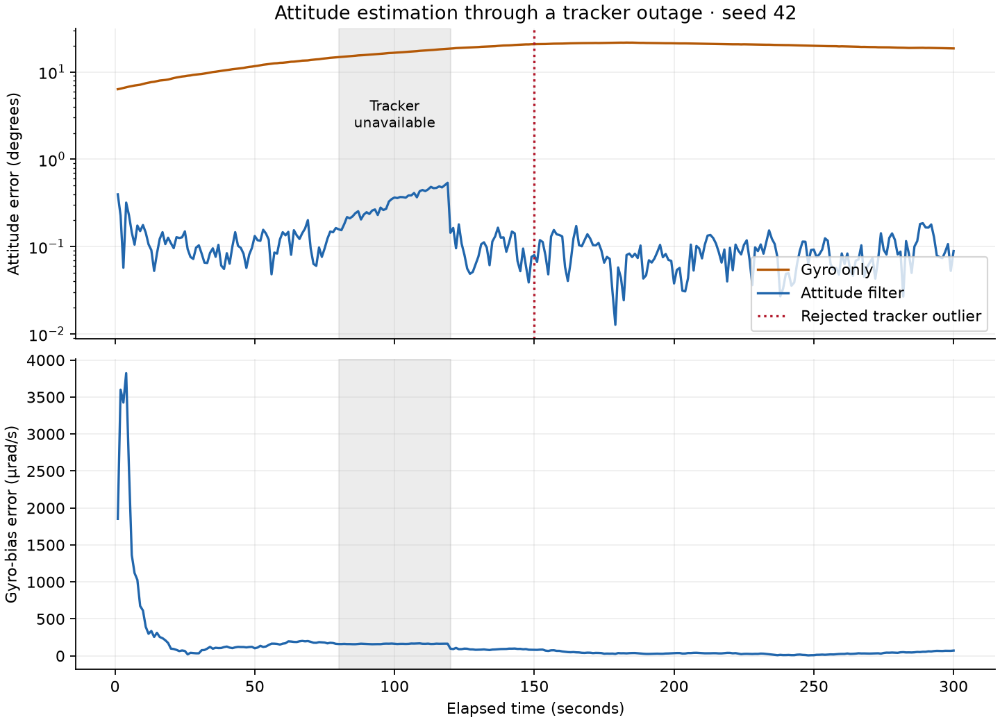

# attitude-filter

close your eyes and point at the door. you know roughly where it is, by feel. now spin slowly for a minute and point again. you are wrong, and you have no idea by how much.

a spacecraft lives that way. its gyroscope is the feel: it reports how fast the craft is rotating, many times a second. its star tracker is the eyes: it photographs stars and says exactly which way the craft points. the trouble is that the eyes blink. bright objects, manoeuvres, and faults can all leave the tracker blind for a while, and during that time the craft points by feel alone.

feel has a flaw. a real gyro is wrong by a small, steady amount called bias. integrate a steady error and it becomes a growing one. in this project's simulation, trusting the gyro alone ends **18.57°** off. the filter ends **0.089°** off, because it learns the gyro's lie while the eyes are open and keeps correcting for it when they close.

## what it does

estimate a spacecraft's orientation through star-tracker outages while learning the gyroscope's persistent bias. a gyroscope measures rotation rate; a star tracker measures orientation from stars. integrating the gyro alone also integrates its bias, so even a small sensor offset becomes a growing pointing error.

the filter represents orientation with a unit quaternion, learns bias alongside it, rejects implausible tracker readings, and moves the uncertainty into the correct coordinates after every accepted correction.

## prediction and measurement updates

the library keeps an orientation, a three-component bias estimate, and a covariance matrix describing uncertainty and the relationships between errors. gyro rates use radians per second; sample intervals use seconds. tracker uncertainty describes small angular errors in radians squared.

```text
gyro + sample interval
          |
          v
subtract estimated bias
          |
          v
predict attitude + uncertainty
          |
          +--> no tracker: keep
          |
          v
tracker + its uncertainty
          |
          v
test angular disagreement
    |               |
  reject          accept
    |               |
    v               v
keep state      correct state
                    |
                    v
            reset error frame
```

for each gyro sample, `propagate` subtracts the current bias estimate and integrates the corrected rate into the quaternion. it also advances the covariance and adds the process noise accumulated over that interval. gyro samples continue during an outage; the filter keeps predicting while its uncertainty evolves.

when a tracker reading arrives, `observe` measures its angular disagreement with the prediction. it compares that residual with the combined prediction and measurement uncertainty. a rejected reading leaves orientation, bias, and covariance unchanged. an accepted reading corrects both orientation and bias.

## orientation and error state

a quaternion has four coefficients constrained to unit length, but a rotation has three degrees of freedom. the filter therefore keeps a six-component error state: three local rotation errors and three gyro-bias errors. it does not treat four quaternion coefficients as independent uncertain quantities.

the rotation convention is explicit: a quaternion rotates body-frame vectors into the inertial frame, and body-rate increments multiply on the right. [the public interface](include/attitude/filter.hpp) states these units and conventions.

## prediction and covariance reset

[the prediction implementation](src/filter.cpp#L28) uses a block-matrix exponential to integrate the linearized error dynamics and continuous noise over a constant-rate interval. bias uncertainty also contributes to attitude uncertainty and their cross-correlation. adding the same arbitrary noise matrix at every sample would make the result depend incorrectly on sampling frequency.

the tracker update solves a factored linear system rather than forming a matrix inverse. a Joseph-form covariance update combines the prior uncertainty and measurement noise in a way that reduces numerical loss of symmetry and positive definiteness.

applying an attitude correction changes the origin of the local error coordinates, so the covariance moves with it. the implementation uses the rotation exponential's right Jacobian, the local map between these error coordinates, to reset the covariance, including its angle/bias cross terms. normalizing the corrected quaternion alone leaves the uncertainty in the old frame.

prediction and correction build and validate a complete candidate before changing the stored estimate. invalid measurements or a failed covariance factorization therefore cannot leave a partially updated filter. [the equations](docs/filter.md) explain the coordinate reset and noise integration.

## simulation results

in the 300-second demonstration, tracker measurements disappear from 80 to 120 seconds, and one false observation arrives at 150 seconds. with seed 42, final attitude error is **0.089°**, compared with **18.57°** for gyro-only integration. the filter rejects the injected false reading. the plot records this controlled simulation, not a real sensor trial.



[the tests](tests/test_filter.cpp) cover:

- transition and covariance-reset Jacobians are compared with finite differences of independent quaternion rotations.
- integrated process noise is checked against a closed-form zero-rate solution and two composed half steps.
- 24 seeded simulations exercise bias estimation, tracker outages, false readings, quaternion sign flips, covariance symmetry, and positive definiteness.

the ensemble uncertainty check is a broad regression check, not a formal statistical consistency study.

## build and reproduce

requires C++20, CMake 3.20+, and Eigen. install Eigen with `brew install eigen` on macOS or `sudo apt-get install libeigen3-dev` on Debian/Ubuntu.

```sh
cmake -S . -B build -DCMAKE_BUILD_TYPE=Release
cmake --build build --parallel 3
ctest --test-dir build --output-on-failure
./build/attitude-demo 42 > trace.csv
```

the demo writes a time series to stdout and a JSON summary to stderr. exact seeded results also depend on the standard library's random distributions. install Matplotlib and run `python examples/plot.py` to reproduce the plot. enable memory and undefined-behavior checks with `-DATTITUDE_SANITIZERS=ON -DCMAKE_BUILD_TYPE=Debug`.

## operating limits

the filter assumes a reasonably close initial attitude and continuing gyro samples during tracker loss. it does not recover attitude from star images, estimate clock offsets, or model tracker-alignment errors. the simulated noise is Gaussian. real sensor data, calibration errors, and timing would need separate validation before using this for spacecraft operation.

the formulation follows Markley and Bauer's [Attitude Error Representations for Kalman Filtering](https://ntrs.nasa.gov/citations/20020060647).

the whole project is a lesson in humility for sensors: every instrument lies a little, and good estimation is mostly the art of learning exactly how.
